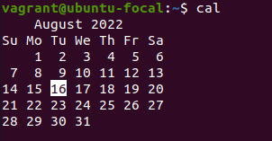
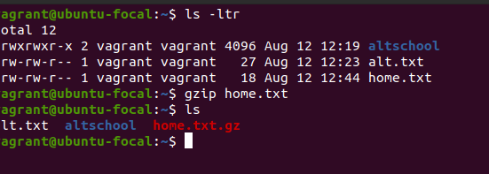
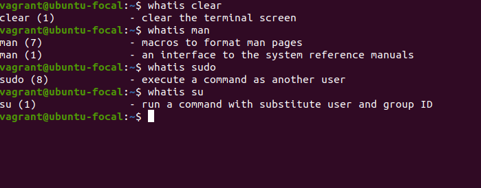
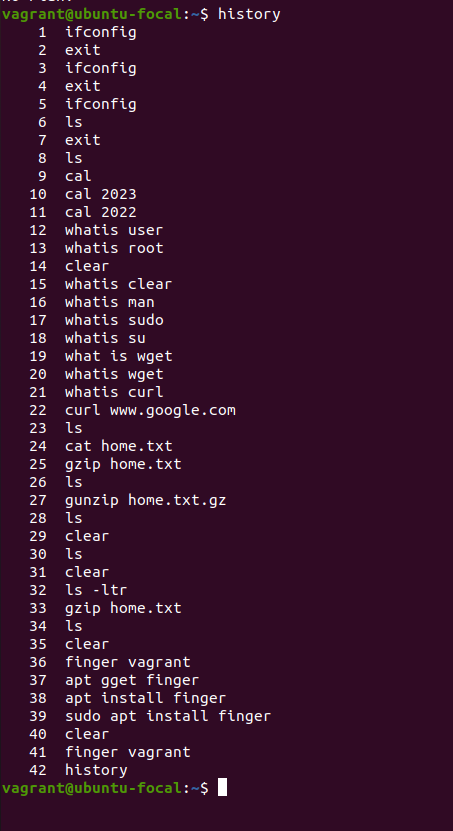
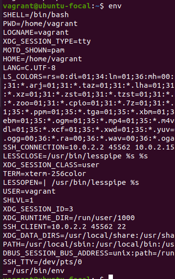
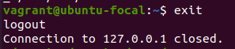
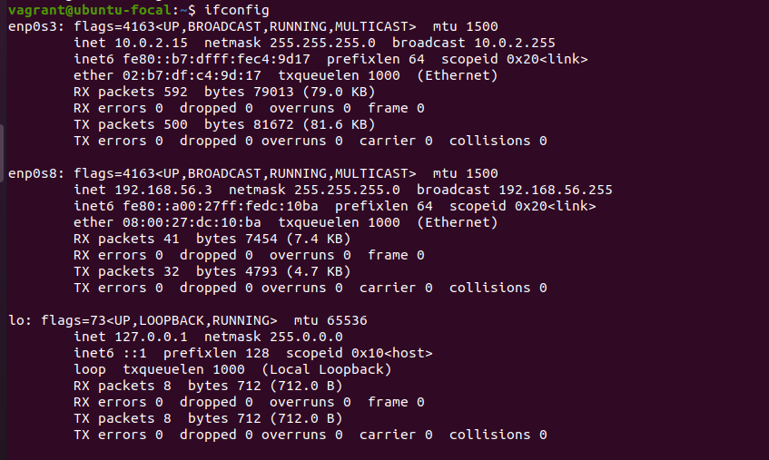
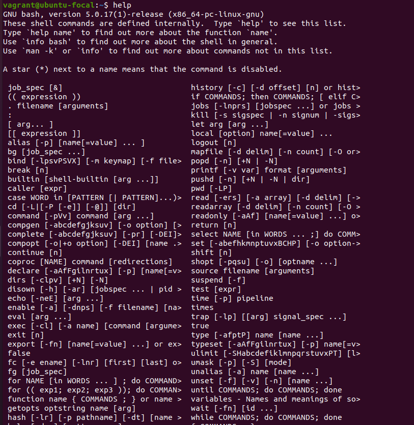
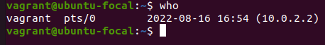

# 10 linux command

## Hi! Here are some most used  **linux** commands. I made research and experiment on linux commands,what they are use for and a screenshot attachment of the result on the terminal.

<br>
<br>
<b>
<br>
<br>
<b>


   ## 1. cal

```
cal <year>command is use to display the calender month and date on the terminal
```



<br>
<br>
<b>
<br>


   ## 2. gzip

```
gzip <filename> command is use to compress any form of file from the terminal and also remove the roiginal file after compressed
```


<br>
<br>
<b>
<br>


   ## 3. whatis

```
whatis <commandname> command gives the description of what a particular command does
```



<br>
<br>
<b>
<br>


   ## 4. finger

```
finger <username> command will display all the information of the user like last login, directory, shell environment in use and so on 
```


<br>
<br>
<b>
<br>


   ## 5. history

```
history command is use to list all the command that has been executed by the user since the OS is installed
```



<br>
<br>
<b>
<br>


   ## 6. env

```
env command is use to display all the environment variables of the user e.g name,language,shell type,pwd etc.
```



<br>
<br>
<b>
<br>


   ## 7. exit

```
exit command is use to close the shell environment directly on the terminal
```



<br>
<br>
<b>
<br>


   ## 8. ifconfig

```
ifconfig command is use to configure network interface, it displays all the available network in the OS
```



<br>
<br>
<b>
<br>


   ## 9. help

```
When you execute this help command in Terminal window, it will list all built-in commands you can use in shell.


```



<br>
<br>
<b>
<br>


   ## 10. who

```
This one is for system administrators who handle and manage various users on Linux system. who command when executed in Terminal show the complete list of those users who are currently logged into Linux system.
```


